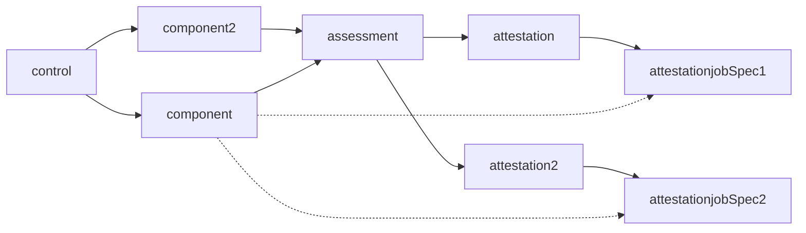
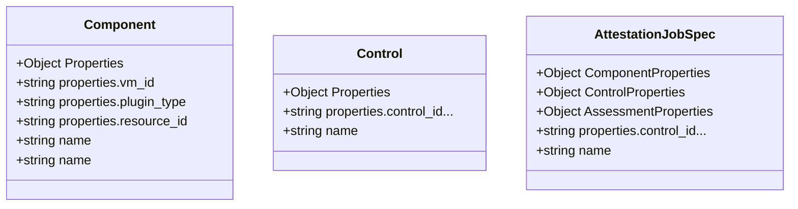
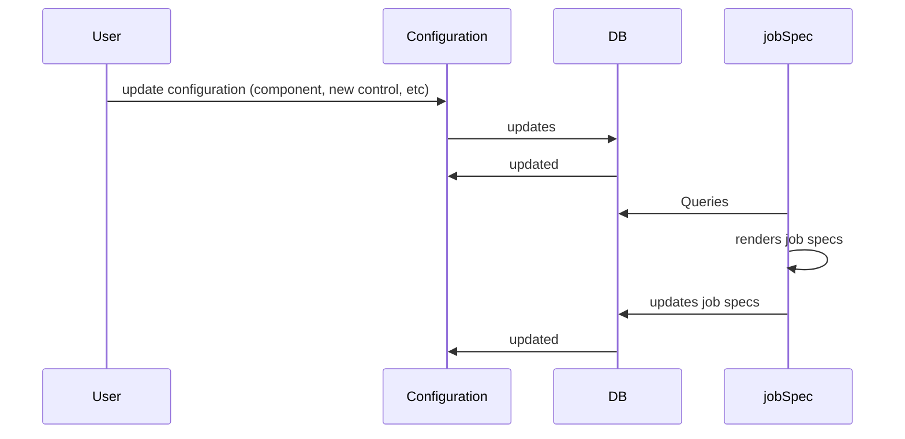
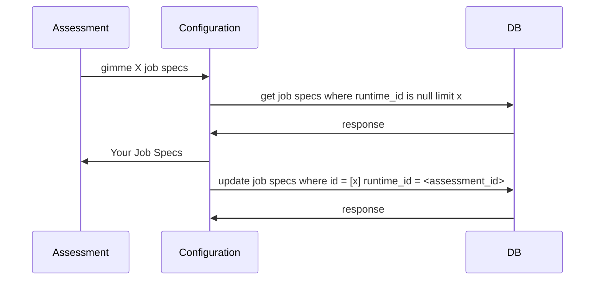
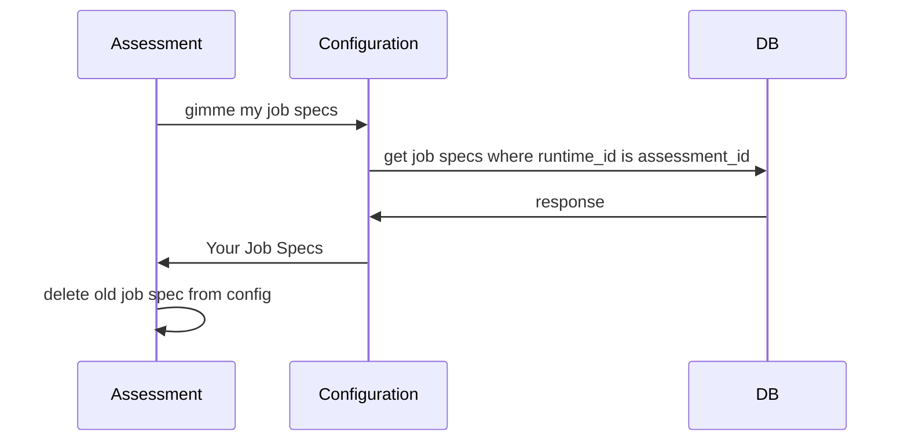

# website
place for architecture, docs, and eventually a website

## Descriptions
### Configuration Service
Configuration Service is responsible for managing any configuration updates to the database, including CRUD operations for Components, Controls, Assessments, Attestations and to some extent on AttestationJobSpecs (configuration might not be responsible for creating the attestationJobSpecs themselves, though)
### Assessment Runtime
  Assessment Runtime is a robust application, developed using Go, designed to execute and manage assessment plugins in the form of WebAssembly (WASM) modules. It serves as a crucial interface between these plugins and the Argus control plane, orchestrating assessments and channeling results back to the control plane for thorough analysis.

The core components of Assessment Runtime include:

* Authentication: This foundational component establishes secure communication with the Argus control plane, handling the task of authenticating the runtime using keys or certificates issued by the control plane. It ensures that all operations conducted through the runtime are verified and trusted.

* Configuration: The configuration component is tasked with synchronizing the runtime's settings with those of the control plane. It pulls the latest configurations from the control plane and applies them to the local configuration store, thereby maintaining a unified setup.

* Scheduler: The scheduler regulates the execution of the assessment plugins. It initiates plugin tasks according to predefined intervals or in real-time, guaranteeing consistent assessment cycles.

* Plugin Downloader: Functioning akin to a Terraform repository, the plugin downloader retrieves the WASM module-based plugins from a central repository. This component assures the availability of the most recent and relevant assessment plugins to be run by the runtime.

* Job Runner: This component provides the required context for the plugins, including the configuration and potentially additional information about the component under assessment. It sets up the ideal environment for plugin operation, enabling them to function optimally.

* Plugin Store: The plugin store component is a local storage system for all downloaded plugins. While the implementation details for the storage of the WASM modules are yet to be determined, this component ensures a local repository for seamless access to plugins.

* Results Collector: The Results Collector component plays a key role in ensuring that the results of the assessments conducted by the plugins are accurately aggregated and communicated back to the Argus control plane. It collects the output from each plugin post-assessment and relays it to the control plane via the application gateway. This guarantees that the control plane is always informed of the latest assessment outcomes, facilitating timely and informed decision-making.

Recognizing the potential scenarios where using the Assessment Runtime may not be feasible or not preferable, for instance when creating an assessment plugin with Azure Functions, we might provide more flexibility. Key functionalities of the runtime could be made available as standalone libraries, compatible with various runtimes. This approach ensures that our suite of tools can be integrated into diverse setups, thereby maintaining the efficiency and utility of the Assessment Runtime environment across a broad range of application scenarios. This also allows us to provide a more flexible and modular approach to the runtime, enabling users to pick and choose the components they require for their specific use case - this can be covered as part of the JobSpec class definition (below are just rough examples for now)
## Configuration<->Assessment Sequence Diagrams
How does a Job Spec gets generated:

How does the structure would look like - *rough example only*:

Sequence Diagram for updating the database

Sequence Diagram for the Assessment Runtime to get more jobs

Because Users can cause a change to the job specs, we need to have a specific flow for checking if the current job specs are still valid and/or changed. The proposed workflow would be something like this:

