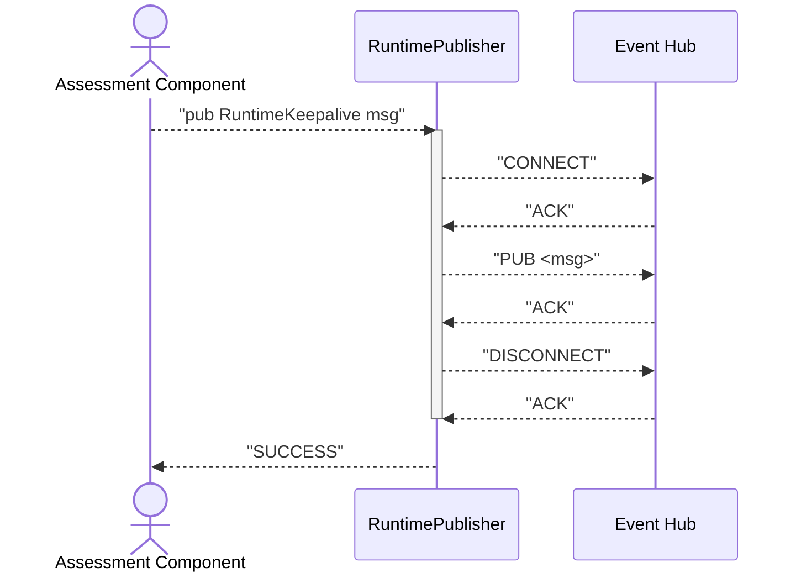
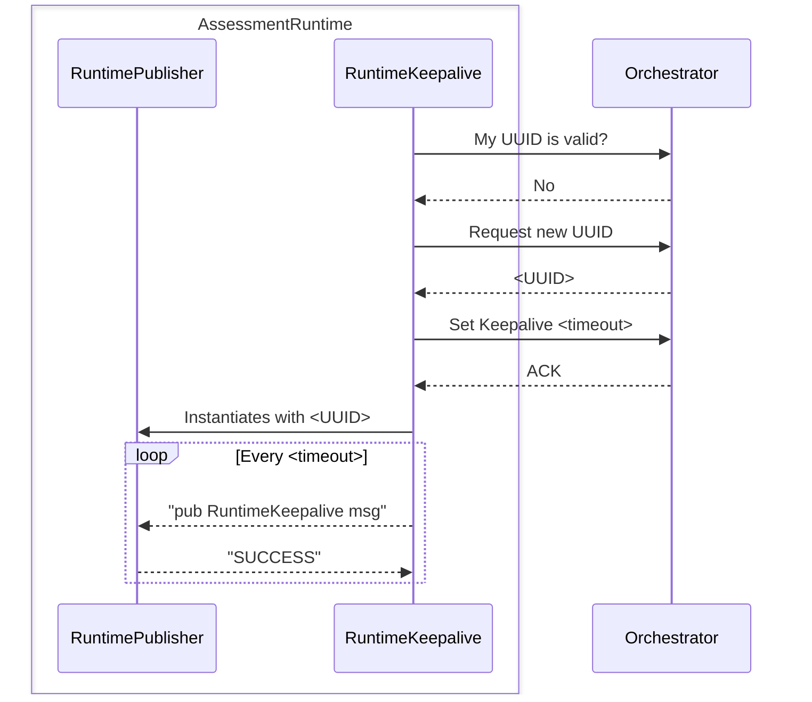
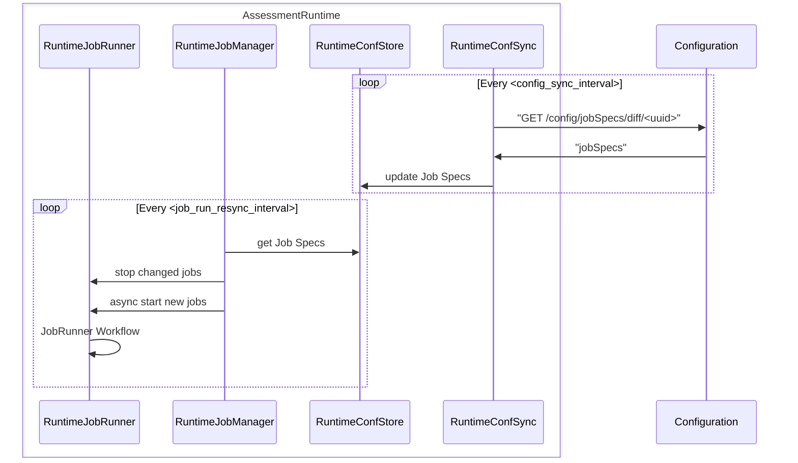
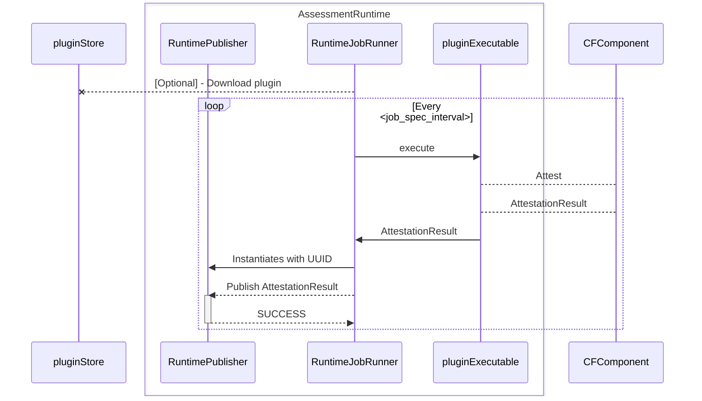

# Assessment Runtime Sequence Diagrams
This document envisions assessment runtime sequence diagrams focused on the different assessment runtime internal components.

### Assessment Runtime - Orchestrator

#### Publisher Workflow

#### Registry & Keepalive workflow

Error on publishing or error on connecting should be handled by the RuntimeKeepalive component, as this might mean it was deregistered due to network failure (so a new UUID request might be needed).

#### JobManager workflow

#### JobRunner workflow

