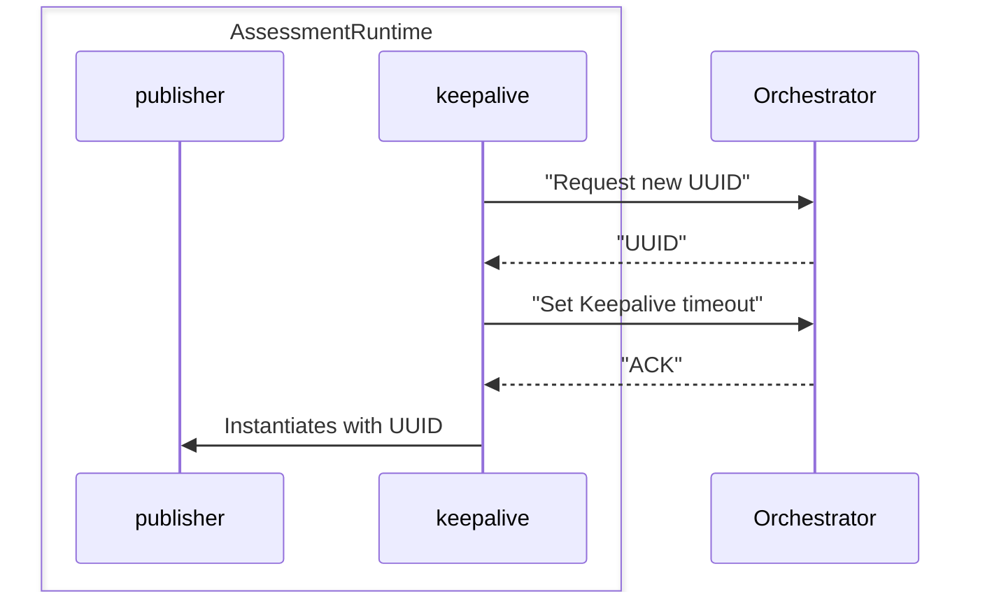
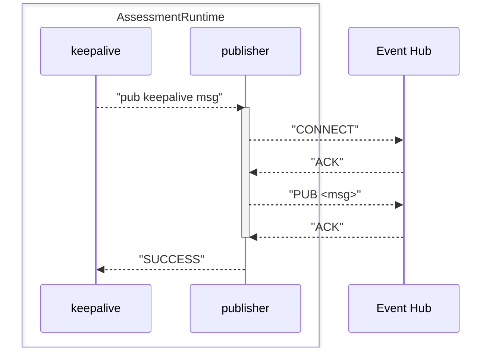

# Assessment Runtime Sequence Diagrams
This document envisions assessment runtime sequence diagrams focused on the different assessment runtime internal components.

### Assessment Runtime - Orchestrator
#### Registry Workflow (TBC)

Error on publishing or error on connecting should be handled by the keepalive component.

#### Keepalive workflow

Error on publishing or error on connecting should be handled by the keepalive component.