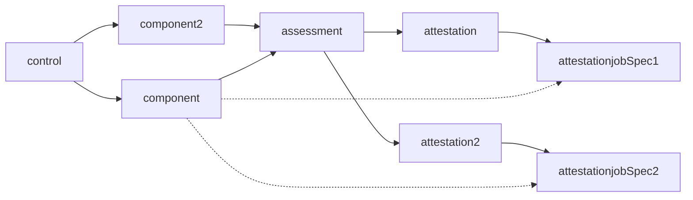
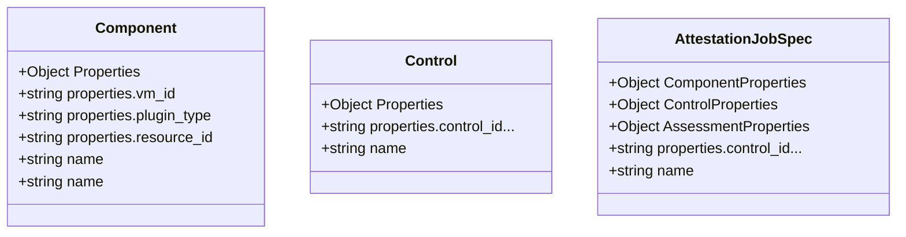
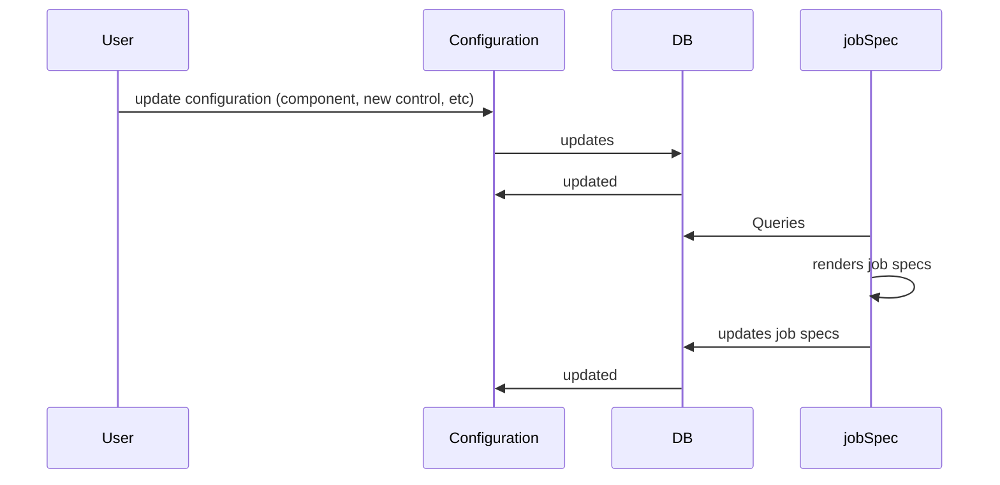
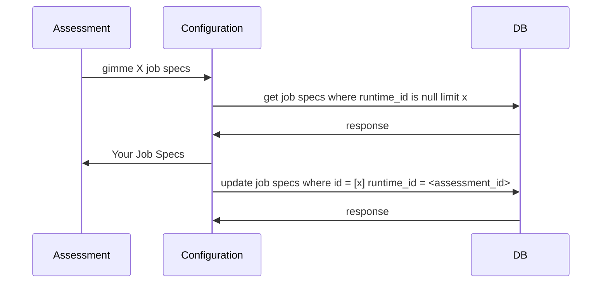
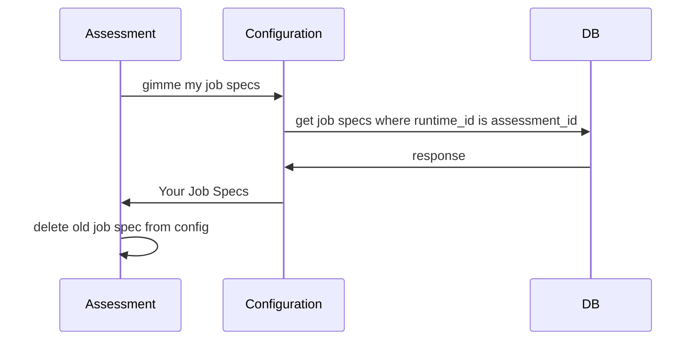
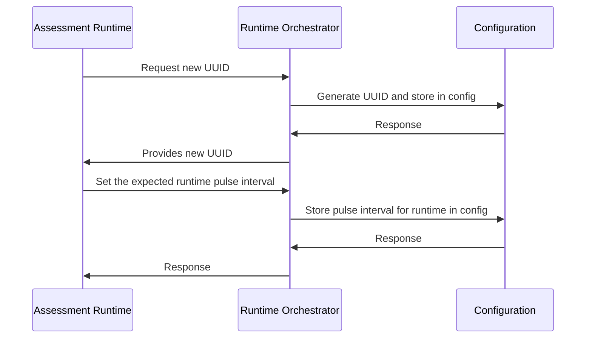
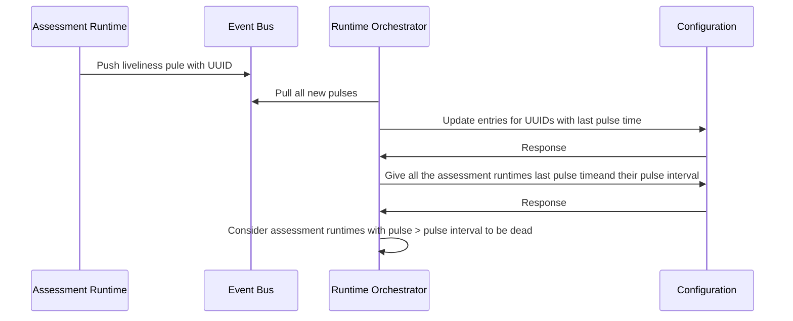

## Configuration<->Assessment Sequence Diagrams
How does a Job Spec gets generated:

How does the structure would look like - *rough example only*:

Sequence Diagram for updating the database

Sequence Diagram for the Assessment Runtime to get more jobs

Because Users can cause a change to the job specs, we need to have a specific flow for checking if the current job specs are still valid and/or changed. The proposed workflow would be something like this:

### Runtime orchestrator Diagrams
The Runtime Orchestrator will be in charge of checking the uptime of the assessment runtimes

