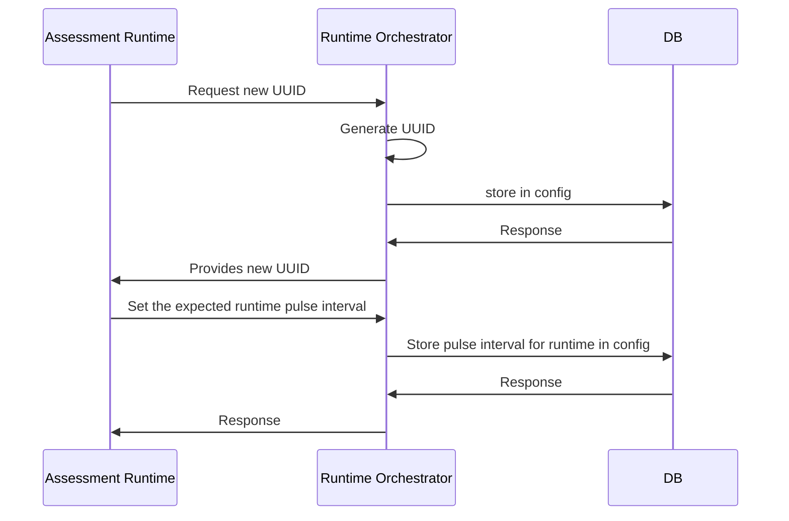
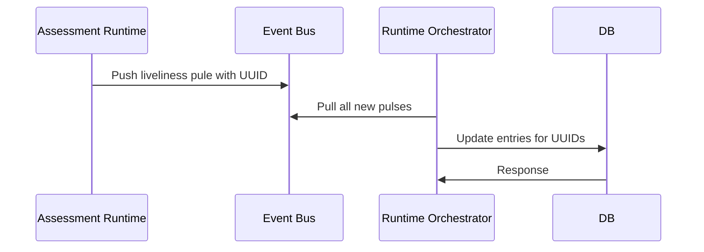
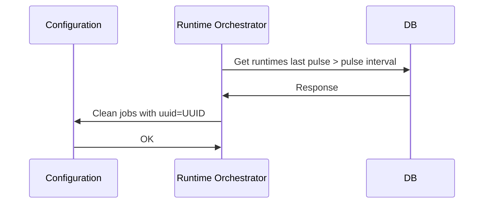

### Runtime orchestrator Diagrams
The Runtime Orchestrator will be in charge of checking the uptime of the assessment runtimes

```mermaid
sequenceDiagram
    Assessment Runtime ->> Runtime Orchestrator: Request new UUID
    Runtime Orchestrator ->> Runtime Orchestrator: Generate UUID 
    Runtime Orchestrator ->> DB: store in config
    DB ->> Runtime Orchestrator: Response
    Runtime Orchestrator ->> Assessment Runtime: Provides new UUID
    Assessment Runtime ->> Runtime Orchestrator: Set the expected runtime pulse interval
    Runtime Orchestrator ->> DB: Store pulse interval for runtime in config
    DB ->> Runtime Orchestrator: Response
    Runtime Orchestrator ->> Assessment Runtime: Response
```

```mermaid
sequenceDiagram
    Assessment Runtime ->> Event Bus: Push liveliness pule with UUID
    Runtime Orchestrator ->> Event Bus: Pull all new pulses
    Runtime Orchestrator ->> DB: Update entries for UUIDs
    DB ->> Runtime Orchestrator: Response
```

```mermaid
sequenceDiagram
    participant Configuration
    Runtime Orchestrator ->> DB: Get runtimes last pulse > pulse interval
    DB ->> Runtime Orchestrator: Response
    Runtime Orchestrator ->> Configuration: Clean jobs with uuid=UUID
    Configuration ->> Runtime Orchestrator: OK

```