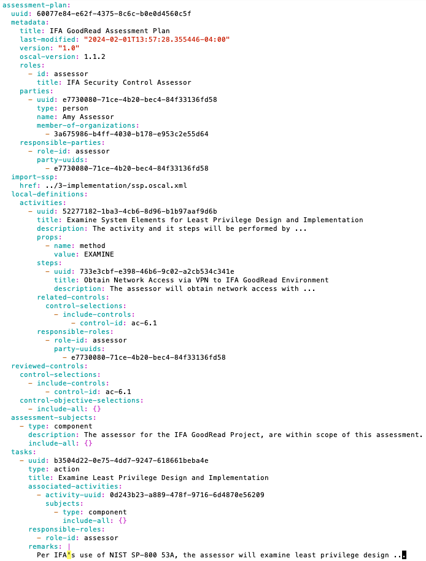
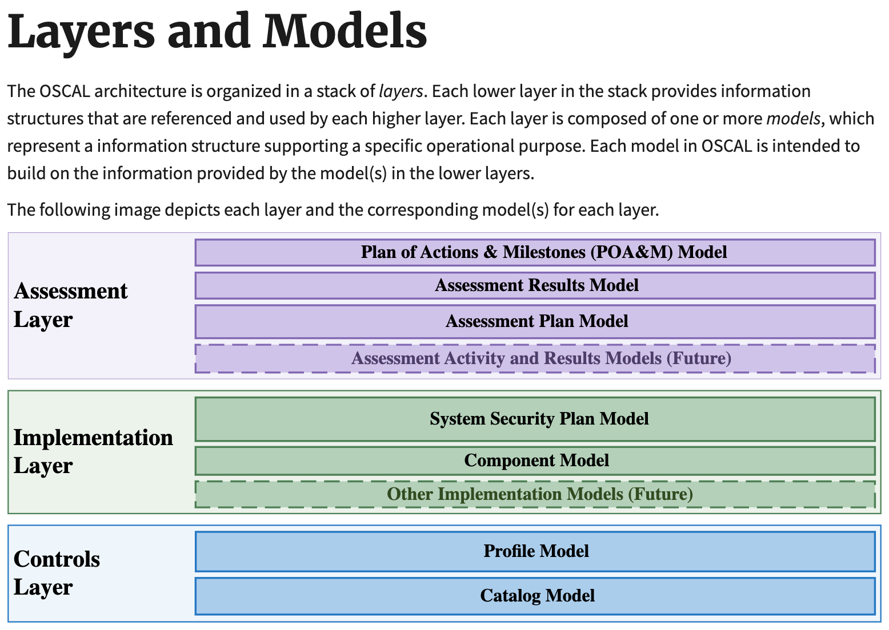
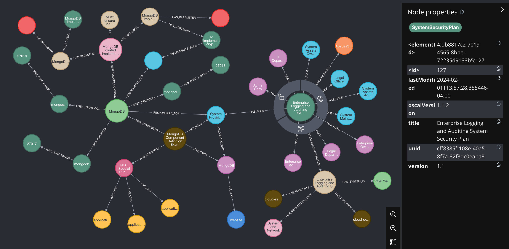
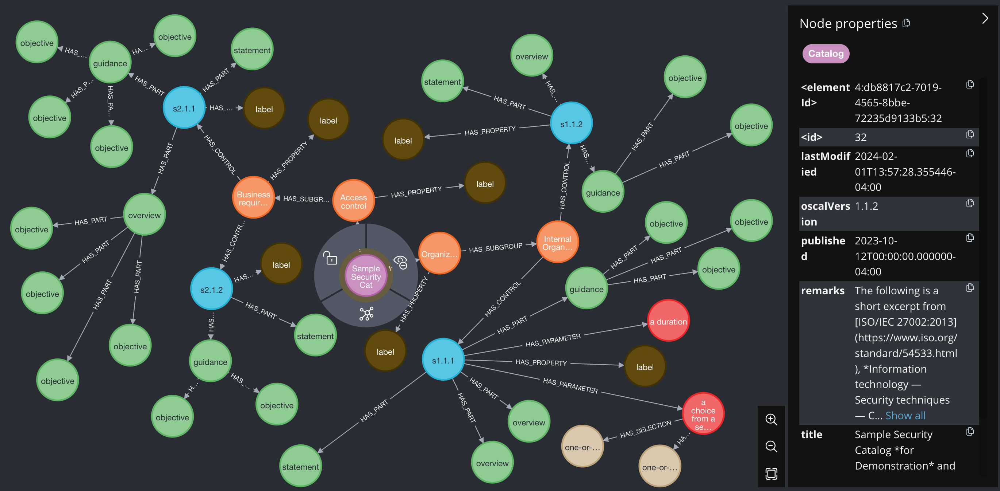
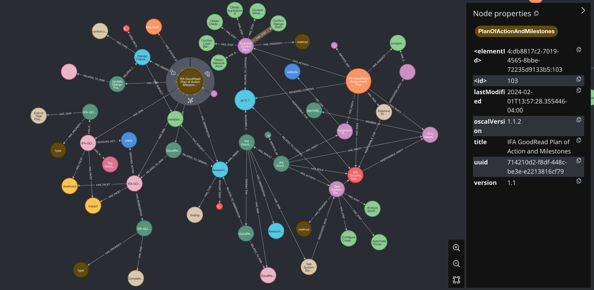

# Exploring OSCAL Using Neo4J

&#8203;

This post is aimed at those interested in continuous compliance, an extension of cloud native principles to the area of software compliance, an under-developed field of software automation.

&#8203;

Container Solutions is working on an [open source project](https://github.com/compliance-framework) to help automate the management and reporting of controls, and this post arose from that work.

## OSCAL?

&#8203;

[OSCAL](https://pages.nist.gov/OSCAL/) stands for "Open Security Controls Assessment Language".

&#8203;

It's a standard maintained by [NIST](https://www.nist.gov/). Like many standards, it's big and full of jargon, difficult for outsiders to grok, and obviously designed by committee, but trying to encompass an area like this across a whole set of industries is hard, and there's no other game in town.

&#8203;

## The OSCAL 'Schema'

&#8203;

OSCAL was created to be a flexible but complete standard for exchanging information about security controls.

&#8203;

It's designed to define machine-readable documents that represent different parts of the controls lifecycle. The idea is that participants and software within this lifecycle can exchange information using a common, machine-readable language.

&#8203;

For example, a regulator might publish "Control Catalogs" using OSCAL as a document format. These publications can then be read by software used by various parties involved in compliance to facilitate their work.

&#8203;

To give you an idea, here's an example, minimal and edited OSCAL document, from the [examples](https://github.com/usnistgov/oscal-content/tree/main/examples) repo. It represents an Assessment Plan, one of the phases in the control lifecycle:

&#8203;

&#8203;

You can imagine how that document could be read by a desktop application which presents this information in a way that can be used by someone about to perform an assessment of controls. Note that the 'uuids' can be referenced by other documents' entities, and that there are uuids that could refer to other documents' entities. This will be relevant later.

&#8203;

Other entities modelled by OSCAL include:

&#8203;

- Catalogs (lists of controls and their details)
- Profiles (sets of controls derived from catalogs)
- Implementations (details of how control is applied)
- Assessment Plans (how the controls will be tested)
- Assessment Results (findings from the assessment process)
- Plan of Action and Milestone (corrective actions for addressing findings)

&#8203;

and here is a visual representation from the [OSCAL site](https://pages.nist.gov/OSCAL/resources/concepts/layer/):

&#8203;

&#8203;

## The Problem

&#8203;

For someone old like me who is used to a more monolithic and relation-oriented schema, OSCAL feels odd. Different documents at different levels may or may not have elements that relate to one another, and might be completely independent. For example, a control definition that exists in one doc might be referenced in another by a UUID being the same, but there's no definition of whether such a relation needs to exist or not.

&#8203;

However, both in practice and in the examples given by NIST, the data 'feels' relational.

&#8203;

## Visualising OSCAL with Neo4J

&#8203;

While working on this, a colleague mentioned [this talk](https://youtu.be/FVCFmSIsYic) from [Alexander Koderman](https://github.com/Agh42) [(slides)](https://www.slideshare.net/neo4j/cybersecurity-automation-with-oscal-and-neo4j) where he demonstrated how to use Neo4J to visualise OSCAL documents. Along the way he discovered errors in the documents and could relate, isolate, and more easily visualise parts of the documents he was looking at.

&#8203;

  <iframe
    src="https://www.youtube.com/embed/FVCFmSIsYic?start=0"
    title="YouTube video"
    frameborder="0"
    allow="accelerometer; autoplay; clipboard-write; encrypted-media; gyroscope; picture-in-picture; web-share"
    allowfullscreen
    style="position: absolute; top: 0; left: 0; width: 100%; height: 100%;"
  ></iframe>

&#8203;

Building on this work, I set up a [repo](https://github.com/containerSolutions/oscal-neo4j) to run up a Neo4J instance in docker, after which I could play with the nodes in an interactive way. This made learning about OSCAL and the relations between the nodes a lot more fun.

&#8203;

Images are available [here](https://github.com/ContainerSolutions/oscal-neo4j/tree/main/images).

&#8203;

### System Security Plan

&#8203;

&#8203;

An OSCAL example System Security Plan (highlighted) and its related nodes. Where possible, size and colour have been used to distinguish different types of node. The type of node can be inferred from the relation described between them in the arrows, but if you click on them, the details can be reviewed.

&#8203;

### Catalog

&#8203;

&#8203;

An OSCAL example catalog (highlighted) and its related nodes.

&#8203;

### Assessment Plan and Plan of Action and Milestones

&#8203;

&#8203;

This graph shows how the Plan of Action and Milestones (highlighted, large brown node) is related to the Assessment Plan (the large orange node). Tracing through, you can see that 'Assessment Plan' nodes are related to 'Assessment Result' nodes via 'Party' nodes and 'Role' nodes.

&#8203;

## Code

&#8203;

The code for running this on your own machine on Docker, along with the above images, is available [here](https://github.com/ContainerSolutions/oscal-neo4j). Simply clone it and run `make full-rebuild` and you will see instructions on how to get the same views on the OSCAL examples.

&#8203;
