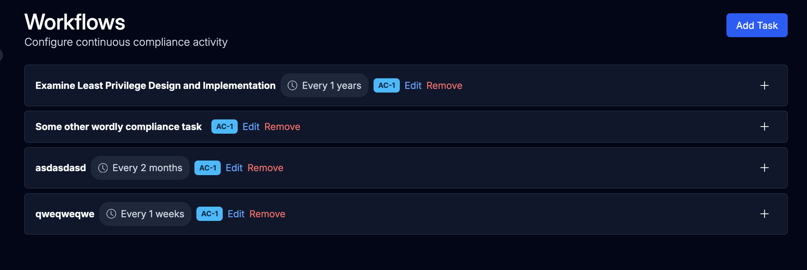
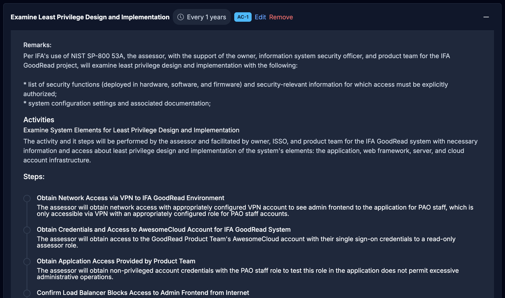

# Workflows - A Sneak Preview

Here's a really quick preview of some of the work we're doing on workflows for continuous compliance.

As we've been showing our open source Continuous Compliance Framework to people, one of the most common requests has been for workflows to help manage the process of implementing and assessing controls in a time-sensitive way.

These requirements are sets of tasks such as:

- Alice must get logs from the firewall

- Bob must review the logs and sign off

- Charlie must attest the sign-off and close off the flow

- This must be done every week, by COB Friday

If any of these tasks are not done, or not done on time, then the workflow is broken and the control is out of compliance.

Of course, if the logs show a problem, then a risk must be raised and a plan of action created to address the problem.

I popped down to the engineering salt mines and got a couple of screenshots of the work in progress.

If this is of interest, please get in touch. We're looking for people to help us test and develop this further. Or you can use the open source project and contribute yourself (when the functionality drops).
